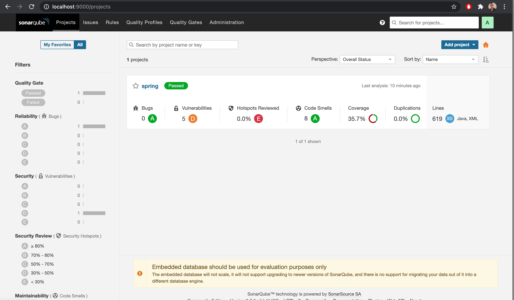
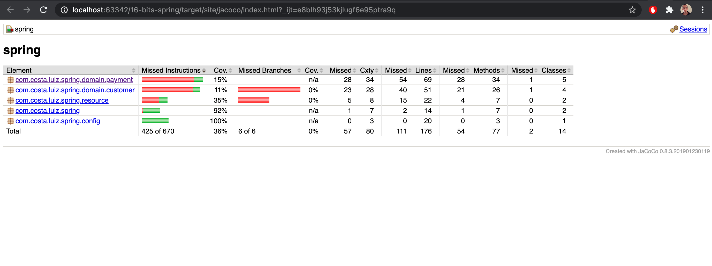

# 16-bits-spring
Project to store the youtube channel code

## Using SonarQube

After 2 minutes you'll have your local SonarQube up and running using Docker.

For it, please access the [SonarQube page](https://docs.sonarqube.org/latest/setup/get-started-2-minutes/) and follow the steps


## Using Maven
Inside the project the configuration for Sonar is on place, and execute the following commands

```
mvn clean install
```  

And then

```
mvn sonar:sonar
```



The report will be sent to SonarQube for analysis and you will be able to see how good your project is.

## JaCoCo
Java Code Coverage

For it, please execute the commands

```
mvn clean test
```

The report will be generated on the folder /target/site/index.html

And then

```
mvn jacoco:report
```
Open this page using the Web browser and enjoy >D

