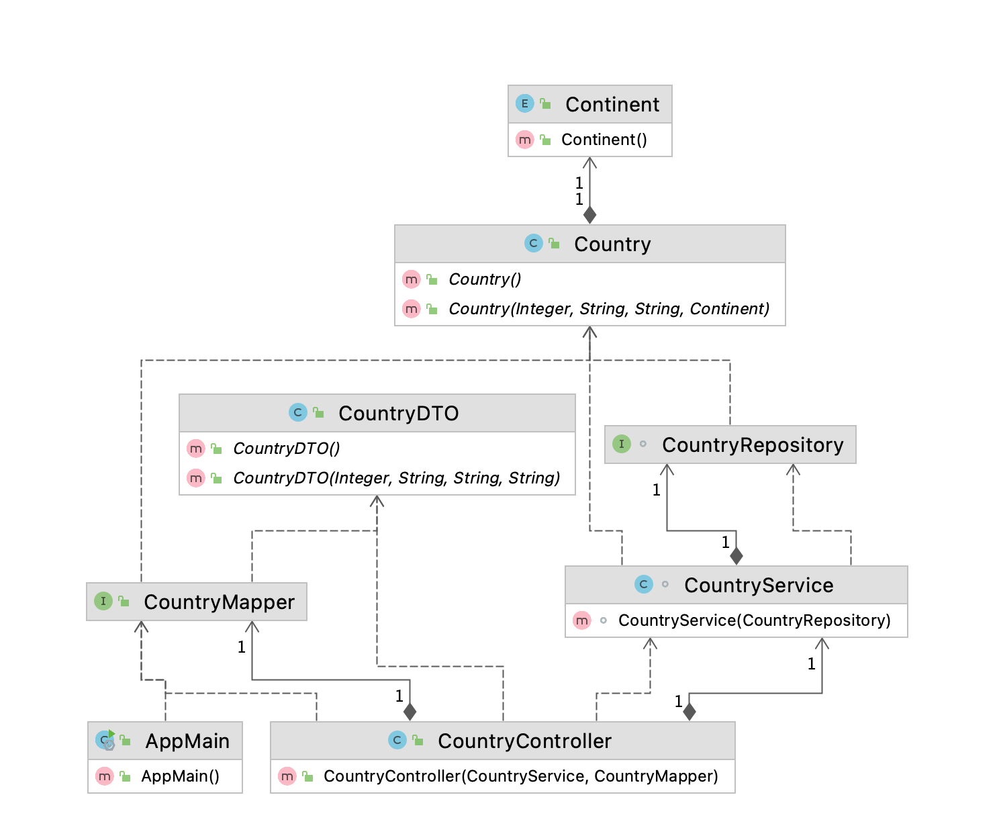

https://mapstruct.org
https://projectlombok.org
https://www.jpa-buddy.com

<!--- STARTEXCLUDE --->
# 16-Bits - UT and IT
A simple SpringBoot application to demonstrate how to use UT and IT.
<!--- ENDEXCLUDE --->
<!--- STARTEXCLUDE --->
## Objectives
* Overview of Lombok, MapStruct, and Liquibase

## How this works
* As a business application, has the Controller, Service, and Repository.
* Has one table to store Country data
* Accepts JSON requests
## Class Diagram


## Prerequisites
* At least Java 11
* Code editor to browse the classes

### Running on your local machine
1. Download the repo using git
```bash
git clone https://github.com/luizgustavocosta/16-bits-spring.git
cd 16-bits-spring/how-2-lombok
```
Then generate the jar
```bash
mvn clean verify
```
And then run
```bash
java -jar target/how-2-lombok-0.0.1-SNAPSHOT.jar
```

<!--- ENDEXCLUDE --->

### Connect to DB
http://localhost:8091/h2-console
jdbc:h2:mem:ut-and-it;DB_CLOSE_DELAY=-1

### Docker
mvn clean package

docker build -t 16-bits/how-2-lombok:0.0.1 .

 
docker run --name how-2-lombok --platform linux/amd64 -p 8092:8092 16-bits/how-2-lombok:0.0.1

### References
http://www.databaseanswers.org/data_models/grocery_store/index.htm